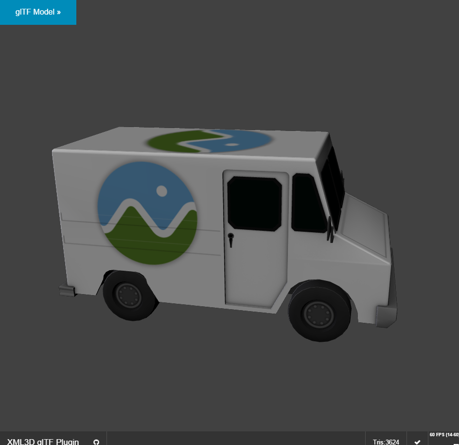
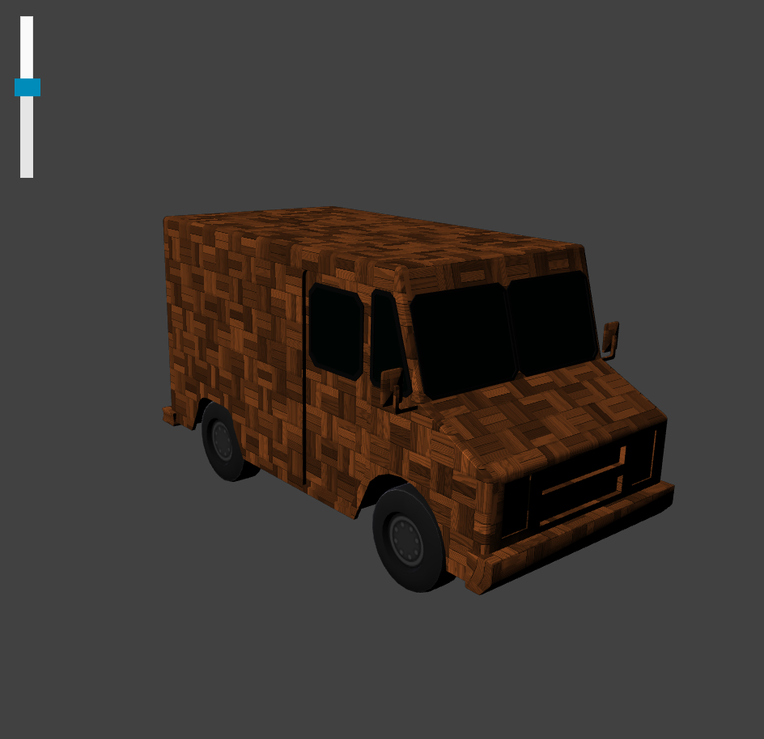

# xml3d-gltf-plugin [](http://opensource.org/licenses/MIT)

This plug-in allows using glTF models as configurable assets in [XML3D](http://xml3d.org) scenes.

__[Examples](http://xml3d.github.io/xml3d-gltf-plugin/examples/)__

## Usage

Include ```xml3d-gltf-plugin.js``` after including the xml3d.js library:

```html
  <script src="xml3d-5.2-min.js" type="text/javascript"></script>
  <script src="xml3d-gltf-plugin-min.js" type="text/javascript"></script>
```

Now, including glTF assets into your scene is as easy as:

```html
<model src="../path/to/your/CesiumMilkTruck.gltf"></model>
```
<a href="http://xml3d.github.io/xml3d-gltf-plugin/examples/"></a>

That's it!

## Advanced Usage

glTF models in XML3D are not static but can be configured. This requires addressing the primitive to configure. 
In [this example](http://xml3d.github.io/xml3d-gltf-plugin/examples/scene.html), we override the material of ```Geometry-mesh002Node0``` with a JavaScript/shade.js wood material: 

```html
<model src="resources/CesiumMilkTruck/glTF/CesiumMilkTruck.gltf">
    <assetmesh name="Geometry-mesh002Node0" material="#mat"></assetmesh>
</model>
```

<a href="http://xml3d.github.io/xml3d-gltf-plugin/examples/scene.html"></a>

This feature is still experimental. Since primitives in glTF have no identifier, we use the glTF mesh id plus the index of the primitive in the primitive array.
In the example above, the mesh's id is ```Geometry-mesh002Node``` and the primitive has an index of ```0```.


## TODOs
* Map skeleton animations to Xflow
* Cameras and Lights
* Shader support (currently, shader parameters are mapped to XML3D shading models)
* Extensions:
   * Binary glTF: [KHR_binary_glTF](https://github.com/KhronosGroup/glTF/blob/master/extensions/Khronos/KHR_binary_glTF/README.md)
   * Common Materials: [KHR_materials_common](https://github.com/KhronosGroup/glTF/tree/master/extensions/Khronos/KHR_materials_common)
   * Other extensions

## License

  MIT License (MIT)
